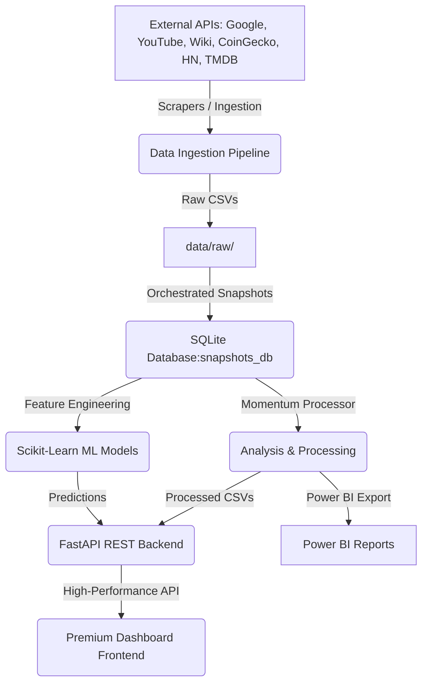

# 🌌 TrendScope

> **Cross-Platform Trend Intelligence & Predictive Momentum Engine**

        

TrendScope is an enterprise-grade trend discovery and forecasting platform. It ingests scattered attention signals from multiple APIs (Google Trends, YouTube, Wikipedia, Hacker News, TMDB, TVMaze, CoinGecko), computes search momentum, stores historical snapshot records in a SQLite database, builds machine learning prediction models to forecast trend spikes, and visualizes them on a premium interactive dashboard.

---

## 🚀 Key Features

* **Multi-Source Ingestion Engine**: Built-in scrapers and API integration layers for:
  - **Google Trends** (search interest time-series via `pytrends`)
  - **YouTube Data API v3** (viral trends and query-based search rankings)
  - **Wikimedia API** (real-time Wikipedia article pageview metrics)
  - **Hacker News** (developer interest & technology discovery tracker)
  - **CoinGecko** (trending cryptocurrencies, ranks, and market search metrics)
  - **TMDB & TVMaze** (global entertainment trend indicators)
* **Momentum Analytics Pipeline**: Normalizes raw data, converts wide format datasets to long, and computes trend direction and mathematical momentum ($Momentum_t = Value_{latest} - Value_{baseline}$).
* **Predictive ML Spike Classifier**: Trains localized `Scikit-Learn` Logistic Regression models to predict the probability of trend momentum spiking in subsequent snapshot windows.
* **Premium Dashboard UI**: Custom glassmorphism dark-theme command console built with **Three.js** (3D particle visualization), **Chart.js** (dynamic trend views), and **System Health LEDs** for monitoring API configurations.
* **BI Export Utility**: Automatically generates clean, relational CSV datasets optimized directly for Power BI dashboard consumption.

---

## 🏗️ System Architecture



---

## 🛠️ Tech Stack & Engineering Rationale

| Technology | Role | Rationale |
| :--- | :--- | :--- |
| **Python 3.11+** | Backend Core | Best-in-class ecosystem for data engineering, API integration, and machine learning. |
| **FastAPI** | REST API Service | Asynchronous, auto-documented (OpenAPI/Swagger), extremely fast, and lightweight. |
| **Pandas / NumPy** | Data Analysis & ETL | High-performance numerical data structures for reshaping, cleaning, and aggregating time-series data. |
| **SQLite** | Snapshot Storage | Serverless SQL engine providing relational querying for historical model training inputs. |
| **Scikit-Learn** | Predictive Modeling | Used for baseline model training, evaluations, and probability inference loops. |
| **Three.js / WebGL** | 3D Visualization | Drives the background data-particle graphics to create an immersive, futuristic dashboard theme. |
| **Chart.js** | Interactive Charting | Clean, canvas-based responsive plotting to visualize multidimensional trend statistics. |

---

## 📂 Project Structure

```
TrendScope/
├── data/                    # SQLite databases and snapshot archives
│   ├── raw/                 # Ingested JSON/CSV datasets from third-party APIs
│   └── processed/           # Normalized datasets with computed momentum
├── frontend/                # Glassmorphic web client
│   ├── index.html           # Command console layout and structure
│   ├── style.css            # Custom CSS styles, glassmorphism theme, & LED animations
│   ├── script.js            # UI logic, chart rendering, and ML dial controller
│   └── three_animation.js   # Background particle systems (WebGL)
├── reports/                 # Exported reports and saved model files
│   ├── figures/             # Auto-generated SVG momentum charts
│   ├── powerbi/             # Relational CSV exports optimized for Power BI
│   └── predictions/         # Serialized ML models (.joblib files)
├── src/                     # Core backend codebase
│   ├── analysis/            # Analytical helpers and trend indicators
│   ├── api/                 # FastAPI routes, middlewares, and startup scripts
│   ├── config/              # Global settings and environment loading configurations
│   ├── dashboard/           # Power BI ETL processor
│   ├── ml/                  # Machine learning classifier architectures
│   ├── pipeline/            # Automated snapshot runs and ingestion schedulers
│   ├── scraping/            # API integration modules and HTTP requests
│   └── storage/             # SQLite connection adapters
├── .gitignore               # Configured to exclude system directories (like virtualenvs)
├── requirements.txt         # Project package dependencies
└── README.md                # Platform documentation
```

---

## ⚙️ Installation & Setup

### 1. Prerequisites
Ensure you have **Python 3.11+** installed on your system.

### 2. Configure Environment
1. Clone the repository and navigate to the project root.
2. Initialize and activate a Python virtual environment:
   ```bash
   python -m venv venv
   # On Windows (Command Prompt / PowerShell):
   venv\Scripts\activate
   # On macOS / Linux:
   source venv/bin/activate
   ```
3. Install the project package dependencies:
   ```bash
   pip install -r requirements.txt
   ```
4. Configure application variables:
   ```bash
   cp .env.example .env
   ```
   Open the `.env` file and set the required API keys (e.g., `YOUTUBE_API_KEY`, `TMDB_API_KEY`) and customize the default keywords to target (e.g., `KEYWORDS="AI, Bitcoin, Climate Change"`).

---

## ⚡ Quick Start

### 1. Execute Snapshot Pipeline
Run the command-line entrypoint to fetch trends, compute momentum, save a database snapshot, and export reports:
```bash
python src/run_pipeline.py
```

### 2. Train Spike Predictor Models
Train the baseline machine learning classifiers for your target keywords:
```bash
python -m src.ml.train_google_spike
```

### 3. Launch Development Server
Start the Uvicorn-based FastAPI server locally:
```bash
python -m uvicorn src.api.main:app --reload --host 127.0.0.1 --port 5000
```
Open **[http://127.0.0.1:5000/](http://127.0.0.1:5000/)** in your web browser to access the premium command console.

---

## 📡 API Reference Endpoints

| Method | Endpoint | Query Parameters | Description |
| :--- | :--- | :--- | :--- |
| **GET** | `/api/health` | None | Returns backend status and system timestamp. |
| **GET** | `/api/status` | None | Returns configuration boolean checks for third-party APIs. |
| **GET** | `/api/google_trends` | `keywords`, `preset`, `timeframe`, `geo` | Dynamically fetches Google Trends and calculates momentum. |
| **POST** | `/api/snapshots/run_google` | `keywords`, `timeframe`, `lookback` | Manually triggers a snapshot run and stores results in SQLite. |
| **GET** | `/api/predictions/google_spike` | `keyword`, `delta` | Infers and returns the spike probability for a given keyword. |
| **GET** | `/api/tv_trends` | `topics` | Fetches popular TV series matched against key topics. |
| **GET** | `/api/wiki_trends` | `topics`, `limit` | Returns top Wikipedia pageviews filtered by keyword queries. |
| **GET** | `/api/hn_trends` | `topics`, `limit` | Returns Hacker News frontpage posts filtered against topics. |
| **GET** | `/api/movie_trends` | `kind`, `topics`, `limit` | Merges TMDB trending and search categories by keywords. |
| **GET** | `/api/crypto_trends` | `topics`, `limit` | Combines CoinGecko trending and interest coins. |
| **GET** | `/api/youtube_trends` | `mode`, `region`, `keywords`, `limit` | Retrieves trending regional videos or search term rankings. |

---

## 🔮 Engineering Roadmap

- [ ] **Advanced Ingestion Scheduling**: Integrate `APScheduler` directly into FastAPI for automated background snapshot tasks.
- [ ] **Multi-Platform Model Variables**: Expand SQL storage models and ML features to include signals from YouTube velocity and Wikipedia pageviews.
- [ ] **Next-Gen Forecasting**: Incorporate time-series forecasting models using Prophet and LSTM architectures to predict trend thresholds.
- [ ] **Dockerization**: Create a multi-stage Docker build config for simple containerized deployments.
